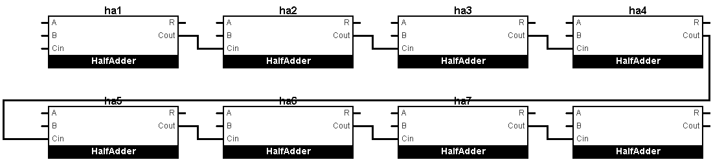

# verilog-practices

### 1. Basic 8 bit full adder
---
##### Boolean expressions

R = Cin ^ A ^ B

Cout = Cin . A + B . A + Cin . B

Testbench simulation example

01010000

00010000

+___________

001100000

Last bit is Cout.

---
